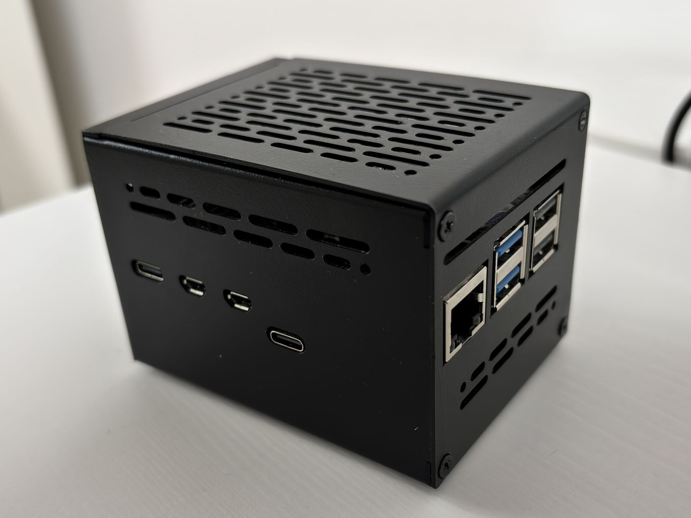
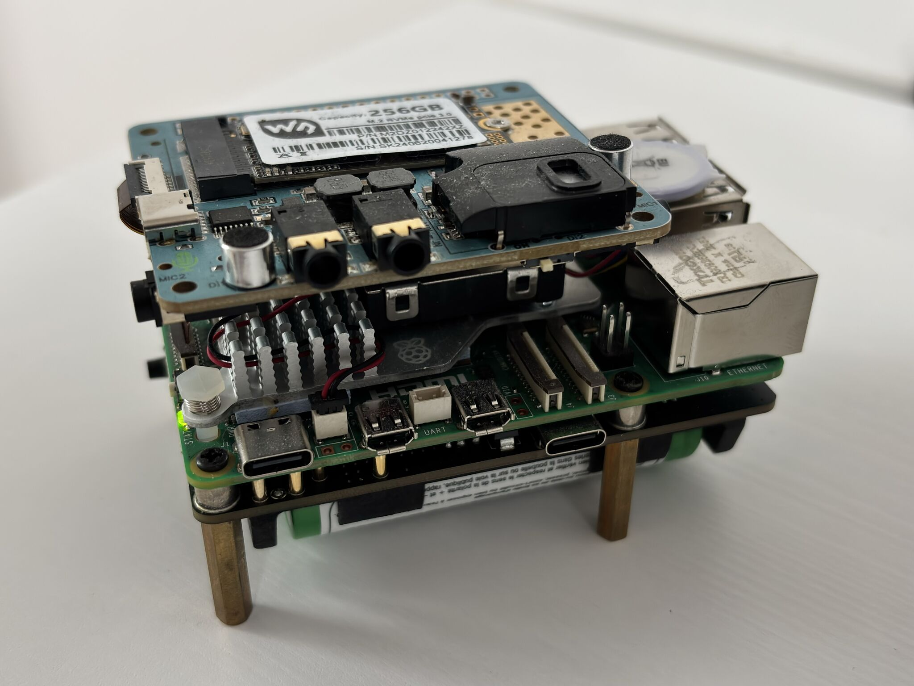

# Native-AI: Localized RAG Voice Assistant

A low-latency, privacy-first voice assistant architecture that combines local Speech-to-Text (STT), Text-to-Speech (TTS), and Retrieval-Augmented Generation (RAG) over a local workspace.

 

## 🛠 Hardware Specifications

### Components List
| Component | Specification |
| :--- | :--- |
| **SBC** | Raspberry Pi 5 Model B, 8GB |
| **Cooling** | Raspberry Pi Active Cooler |
| **Timekeeping** | RTC Battery |
| **Power Management** | Geekworm X1200 UPS + 2 18650 Batteries |
| **Enclosure** | Geekworm X1200-C1 case |
| **Storage** | Waveshare 256GB NVME 2242 |
| **Audio I/O** | Raspiaudio Pi Audio Drive |

---

## ⚡ Core Architecture
Unlike cloud-reliant assistants, this system operates entirely on local hardware, leveraging:
- **STT:** Vosk (Kaldi-based) for offline, low-resource phoneme recognition.
- **LLM:** Llama.cpp server integration with custom stream-processing for sentence-based TTS chunking.
- **TTS:** Piper (Onnx) for high-speed, neural voice synthesis.
- **Memory/RAG:** ChromaDB with `all-MiniLM-L6-v2` embeddings for real-time indexing of your local `/workspace` directory.

## 🔄 System Flow
The assistant operates across three primary parallel threads to ensure the UI/Voice loop never blocks on heavy I/O operations.

### Parallel Processes
1.  **Main Control Loop:** Handles ALSA audio input, wake-word detection via partial-result parsing, and orchestrates the "Thinking" state.
2.  **RAG Sync Worker:** A background daemon that monitors the filesystem. It hashes local files and upserts changes into a vector database, ensuring the LLM has up-to-date context of your project files.
3.  **Piper TTS Worker:** A consumer-producer queue that accepts text fragments and pipes raw audio data directly to the hardware via `aplay`.

## 🛠 Prerequisites
- **LLM Server:** A `llama.cpp` or compatible server running at `localhost:8080`.
- **System Deps:** `libasound2`, `piper-tts`, and `vosk-model-small-en-us`.
- **Python Env:** `chromadb`, `pyaudio`, `sentence-transformers`.
