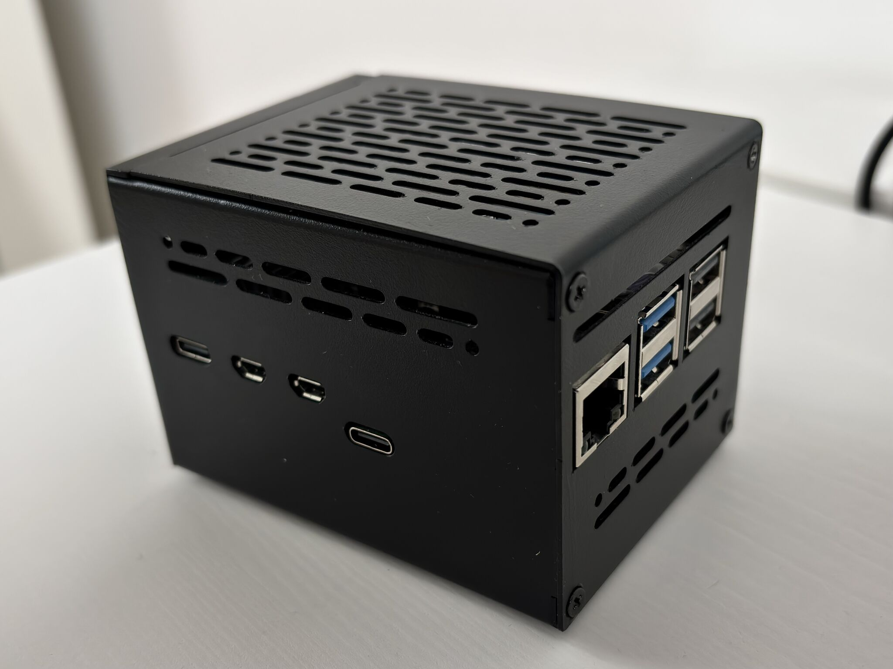
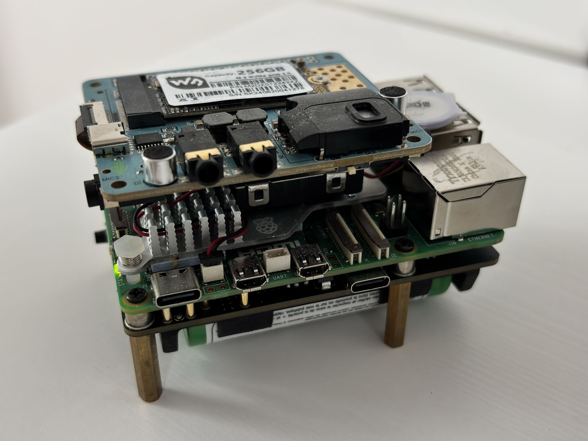
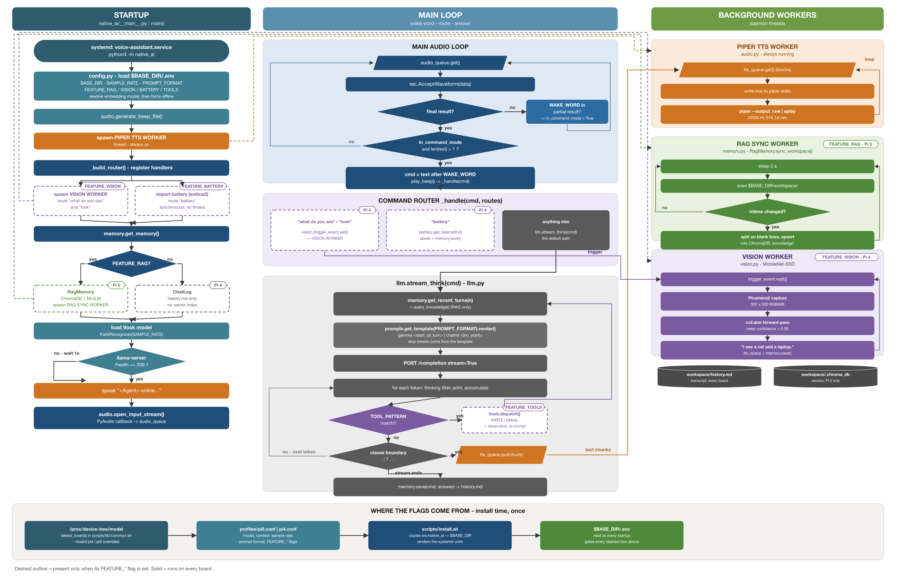

# Native-AI: Localized RAG Voice Assistant

A low-latency, privacy-first voice assistant that runs entirely on a Raspberry Pi. Speech recognition, the language model, and speech synthesis all execute on the device — nothing is sent anywhere.




## 🎛 Supported Boards

One codebase serves both boards. `scripts/install.sh` reads `/proc/device-tree/model`, picks the matching profile from [profiles/](profiles/), and enables only what the hardware can carry.

| | Raspberry Pi 5 (8 GB) | Raspberry Pi 4 |
| :--- | :--- | :--- |
| **Model** | Gemma 4 E4B (Q4_K_M), 4096 ctx | Qwen 2.5 0.5B Instruct (Q4_K_M), 2048 ctx |
| **Prompt format** | Gemma `<start_of_turn>` | ChatML `<\|im_start\|>` |
| **Audio** | Raspiaudio Pi Audio Drive, 48 kHz | Google VoiceHAT, 16 kHz |
| **RAG over `workspace/`** | ✅ | — (no headroom for ChromaDB) |
| **Camera object detection** | — | ✅ MobileNet-SSD via Picamera2 |
| **Battery telemetry** | — | ✅ INA219 over I²C |
| **Tool calls (write/email)** | ✅ optional | — |

Adding a third board means writing one file in [profiles/](profiles/) — see [docs/configuration.md](docs/configuration.md#adding-a-board).

## 🚀 Quick Start

```bash
git clone <this-repo> native-ai && cd native-ai

./scripts/system-setup.sh     # OS, firmware, ALSA routing — then reboot
sudo reboot

./scripts/install.sh          # llama.cpp, models, venv, systemd units
```

Both scripts detect the board automatically; pass `--board pi4` or `--board pi5` to override, and `--dry-run` to see every action without changing anything.

Then say your wake word — the lowercased `AGENT_NAME` from `.env`, `agent` by default:

> *"Agent, what is on my calendar?"*

Full instructions: [docs/system-setup.md](docs/system-setup.md) → [docs/install.md](docs/install.md).

## ⚡ Architecture

- **STT:** Vosk (Kaldi-based) for offline, low-resource phoneme recognition. The wake word is spotted in *partial* results, so the assistant reacts before you finish the sentence.
- **LLM:** a `llama.cpp` server on `localhost:8080`, streamed token by token.
- **TTS:** Piper (ONNX) neural synthesis, piped straight into `aplay`.
- **Memory:** an append-only transcript on every board; on the Pi 5, also a ChromaDB index of `workspace/` using `all-MiniLM-L6-v2` embeddings.

## 🔄 System Flow

The assistant runs several threads so the voice loop never blocks on heavy I/O.



1. **Main control loop** — ALSA capture, wake-word detection, and command routing.
2. **RAG sync worker** *(Pi 5)* — watches `workspace/`, re-indexing files whose mtime moved.
3. **Piper TTS worker** — consumes text fragments and speaks them. The LLM stream is cut into clauses on the fly, so speech starts while the model is still writing.
4. **Vision worker** *(Pi 4)* — captures a frame on demand and names what it sees.

Dashed boxes in the diagram exist only when their `FEATURE_*` flag is set. The
editable source is [docs/flow.svg](docs/flow.svg).

## 📁 Layout

```
profiles/       board profiles — the only place hardware differences live
src/native_ai/  the assistant package (deployed to $BASE_DIR/native_ai)
scripts/        install, provisioning, and maintenance; shared helpers in lib/
systemd/        service unit templates
docs/           setup, install, configuration, and add-on guides
```

## 📚 Documentation

| Guide | Covers |
| :--- | :--- |
| [docs/hardware.md](docs/hardware.md) | Parts list per board |
| [docs/system-setup.md](docs/system-setup.md) | First-boot OS, firmware, and audio provisioning |
| [docs/install.md](docs/install.md) | Deploying the assistant and managing the services |
| [docs/configuration.md](docs/configuration.md) | Every `.env` key, every profile key, adding a board |
| [docs/tools.md](docs/tools.md) | Optional file-writing and email tools |

## 📄 License

MIT — see [LICENSE.md](LICENSE.md).
